# Manusctipt Title

## Abstract

## Introduction

## Results

### Lab Contamination Survey

#### Sample Statistcs

To address the issue of contamination, we comprehensively collected a large number of negative control samples (NCT) at each stage of the wet-lab sample processing workflow (Fig. xxx), including **93** paraffin controls, **133** buffer controls, **11** PCR controls, and **3** sequencing controls, resulting in a total of 6128 taxa. We remove sequencing control samples due to insufficient reads (≤ 750) as well as taxa with extremely low prevalence and abundance. With that criteria, we further filter out and result in **203** negative control samples, comprising **113** buffer controls, **84** paraffin controls, and **6** PCR control. That results in **1775** taxa after rarefaction as normalization. These negative controls were accumulated over several years, with a significant expansion in control type paraffin and buffer introduced in 2022 (Table 1 ).

**Table 1.** Negative control samples collected over years.

| Sample ↓ / Feature → | 2021 | 2022 | 2023 | 2024 |
|----------------------|------|------|------|------|
| Buffer               | 29   | 60   | 24   | 0    |
| Paraffin             | 5    | 57   | 11   | 12   |
| PCR                  | 0    | 3    | 3    | 0    |

#### Alpha & Beta Diversity

Significant differences in microbial profiles (alpha and beta diversity) were observed across different control types (Fig. 1 & 2). Similar patterns were also found for other factors such as technician, year, and season of sequencing (in Supplementary Materials Figure xxx). In buffer samples, the number of species and their evenness statistically significant than the others.

|  |  |  |
|----|----|----|
| 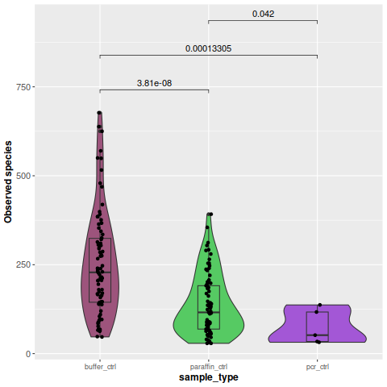 | 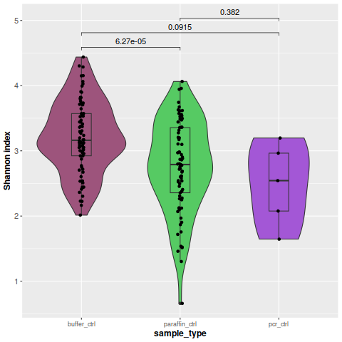 | 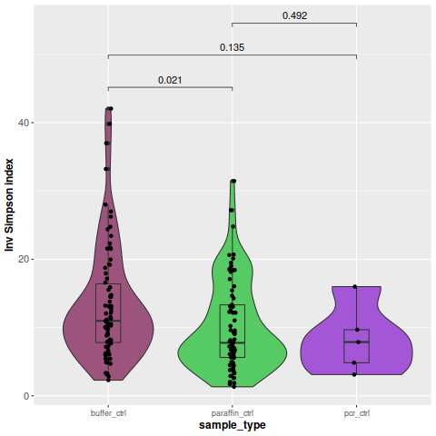 |

**Figure 1.** (A–C) Alpha diversity of NCT types w.r.t number of observed species(A), Shannon Index(B), and inversed Simpson index(C).

|  |  |
|----|----|
| 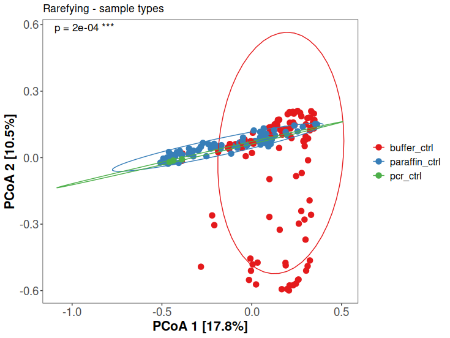 | 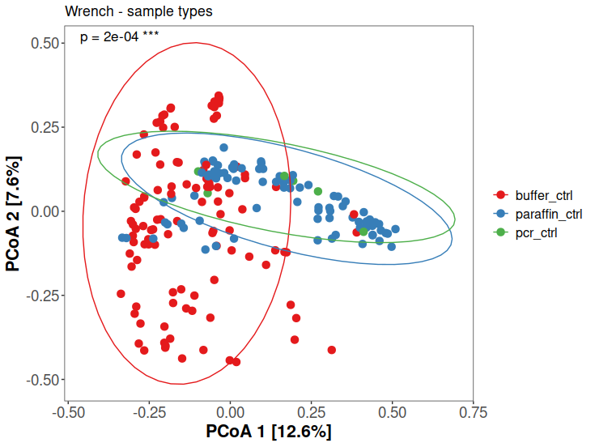 |

**Figure 2.** (A-B) Beta diversity of various NCT samples, with rarefaction and Wrench normalization respectively.

#### Microbial Profile of NCT Samples

The 20 most abundant taxa in whole set of NCT represented a mixture of known environmental microbes and potential human commensals (Fig. 3). For example, *Sphingomonas*, a well-known environmental taxon frequently found in hospital settings, was detected with high abundance in nearly all negative controls. In contrast, human-associated taxa such as *Veillonella parvula*, previously reported in PDAC-related52 studies [@McKinley2023], were present in approximately 60 percent of NCT samples but at significantly lower abundance (Fig.3). This highlights the importance of not discarding all taxa found in negative controls, but instead applying appropriate decontamination approaches [@Austin2023; @Davis2018; @Nejman2020] to systematically remove likely environmental contaminants.

|  |  |
|----|----|
| 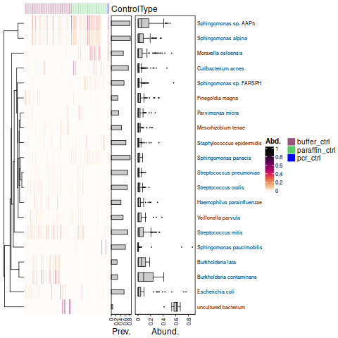 | 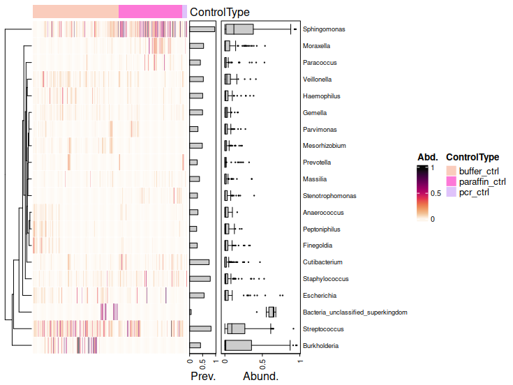 |
| 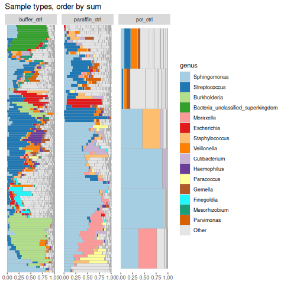 | 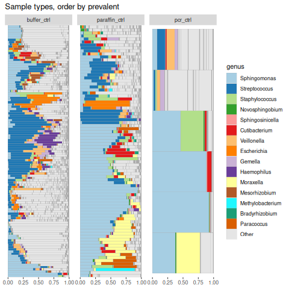 |

**Figure 3.** Bacterial heatmap of NCT samples by species and genus (top, left to right) of top 20 most abundance taxa. Bacterial barplot of top 20 genus order by abundance and prevalence respectively (bottom, left to right).

Beside negative control sample types, Contaminants in the laboratory could be strongly affected by seasons. ......

|  |  |
|----|----|
| 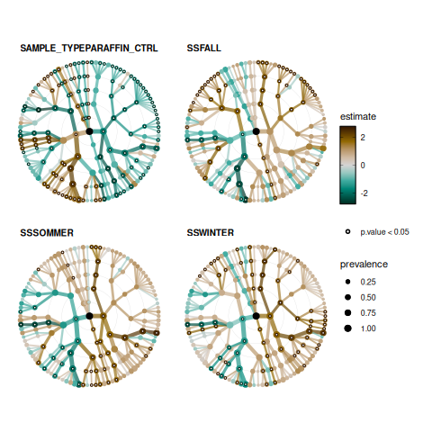 | 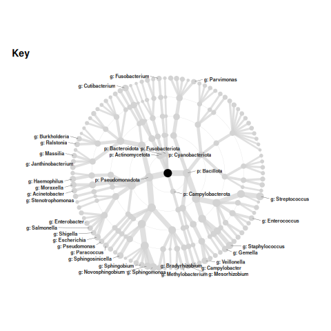 |

**Figure 4.**

### Contamination - Hood versus Bench

We were intrigued by how human commensals might enter negative control samples. To investigate this, we conducted an experiment in which negative samples were processed by two technicians under different environmental conditions, as described in Fig. 2A and detailed in the Materials and Methods section. Analysis of alpha diversity revealed no significant differences across environmental conditions, instead the person has an opposite direction. (Fig. 2B). Similarly, beta diversity analysis showed that samples clustered significantly by technician (\hlred{$p < 0.001$}), but not by environmental conditions alone (\hlred{$p = 0.596$}; Fig. 2C).

|                               |                             |
|-------------------------------|-----------------------------|
| 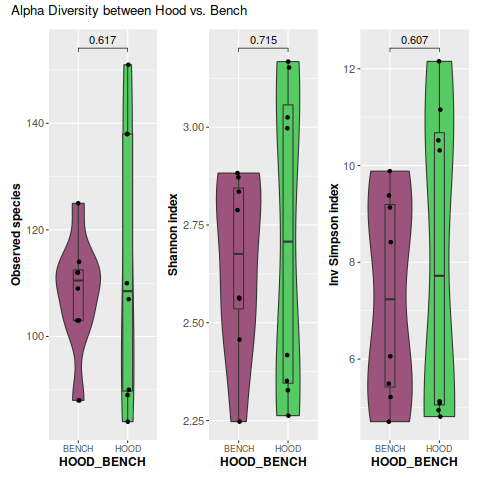 | 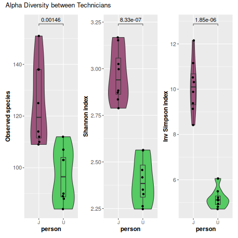 |

**Figure 5.** Alpha diversity of NCT sample w.r.t environmental conditions(left) and technicians (right).

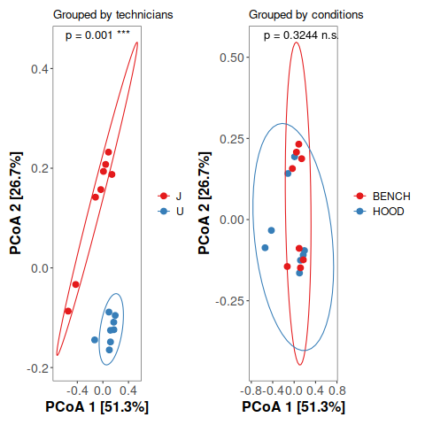

**Figure 6.** Beta diversity cluster by conditions and technicians respectively.

### Intratumor Bacterial Profile of Fresh Frozen Samples

## Discussion

## References
