# Disentangling contaminants from true intratumoural microbial signals in pancreatic ductal adenocarcinoma – A benchmarking approach

Linh Dang, Johannes Richter, Louisa Eskelson, Areej Shahbaz, Jacob Hamm, Tim Beißbarth, Volker Ellenrieder, Albrecht Neesse, Christoph Ammer-Herrmenau

## Abstract

**Background**: Malignant tumors or more specifically Pancreatic ductal adenocarcinoma (PDAC) harbors their own distinct intratumoral microbiome, yet rigorous characterization of its composition is hampered by pervasive environmental and procedural contamination. Negative controls collected throughout the sample processing workflow capture a heterogeneous mixture of environmental, and technician-derived microbes that, if unaccounted for, mislead 16S rRNA sequencing results.

**Methods**: We systematically collected more than 200 negative control (NCT) samples comprising buffer, paraffin, and PCR controls, over period of four years and other possible significant batches such as years, seasons, technicians. We benchmarked four decontamination methods (Restrictive filtering, Decontam, SCRuB, and the Nejman pipeline) against fresh frozen PDAC samples, using above NCT survey to calculate a composite score for the assessment. Further, we validated those methods via technical replicas with Aitchison distance between them as orthogonal evaluation metrics.

**Results**: Microbial profiles of NCT samples were significantly determined by control type, technician, year, and season, reflecting complex batch effects. The 20 most abundant contaminant taxa spanned well-characterized environmental genera (e.g., *Sphingomonas*) and human commensals (e.g., *Veillonella parvula*). Decontamination benchmarking demonstrated that the Nj method consistently outperformed alternatives in both composite score and inter-replicate concordance. Application of Nj to fresh frozen PDAC samples substantially reduced contaminant burden while preserving putative tumor-associated signals.

**Conclusions**: This benchmarking framework, combining longitudinal NCT profiling with technical replication, enables principled assessment of decontamination performance in the absence of a ground truth. Our results support the adoption of the Nj decontamination pipeline for future intratumoral microbiome studies in PDAC and provide a reliable, quality control strategy for low-biomass 16S sequencing studies.

**Keywords**: pancreatic ductal adenocarcinoma, tumor microbiome, decontamination, negative controls, 16S rRNA sequencing, benchmarking.

**Note**: significant and new literatures should be mentioned:

-   Salzberg 2026 [@Salzberg2026] - Setting higher standards for reports of microbial species in human cancers
-   Cite [@Austin2023] SCRuB paper for benchmarking on simulation data, as well as in clinical data, but highlight its limitation.
-   Highlight our Nj procedure adaptation, using Fisher test instead of Binomial test, due to small number of samples. [@Neuhuser2025]

## Introduction

------------------------------------------------------------------------

The intratumoral microbiome has emerged as a potentially important component of the tumor microenvironment, influencing immune evasion, drug metabolism, and clinical outcomes across multiple cancer types [[citations]{style="color:red"}]. In pancreatic ductal adenocarcinoma (PDAC), one of the most lethal malignancies, recent studies have reported the presence of distinct intracellular bacterial communities that may contribute to disease pathogenesis and immunosuppression [[citations]{style="color:red"}]. However, a fundamental challenge in tumor microbiome research is distinguishing genuine tumor resident microorganisms from environmental contaminants introduced during sample collection, processing, and sequencing. Low biomass specimens such as FFPE tissue sections and tumor biopsies are particularly vulnerable to contamination, as trace microbial DNA from reagents, laboratory surfaces, and personnel can overwhelm endogenous taxa. Prominent environmental taxa such as **Sphingomonas, Ralstonia, and Pseudomonas** are routinely detected in negative controls and have been reported as dominant species in tumor microbiome studies that lack rigorous decontamination [@Riquelme2019; @Guo2021].

Several computational decontamination approaches have been proposed to address this problem, including Decontam [@Davis2018], SCRuB [@Austin2023], and the strategy employed by Nejman et al. [@Nejman2020] (hereafter, Nj). These methods differ in their statistical assumptions, required inputs, and aggressiveness of taxon removal. Nevertheless, a systematic, empirical comparison of their performance in the context of PDAC tumor microbiome profiling has been lacking. Here, we present a benchmarking framework that leverages a longitudinal collection of negative control (NCT) samples acquired across all major wet lab processing steps, combined with technical replicates of PDAC tissue samples. We evaluate four decontamination strategies using a novel composite score, balancing taxon yield and purity relative to the NCT-derived contaminant profile, and validate findings using inter-replicate Aitchison distances. This work provides practical guidance for microbiome researchers seeking to generate reliable intratumoral microbial profiles from low-biomass clinical specimens.

## Results

***Structure for result section***

<!--[some *blue* text]{style="color:green"}. -->

-   Contaminant species survey in the lab
    -   [Description of data collection, number of samples and taxa, significant batch effects.]{style="color:green"}
    -   [Alpha/beta analyses.]{style="color:green"}
    -   [Barplot composition / heatmap plot of bacterial composition of NCT.]{style="color:green"}
    -   [DAA among control types]{style="color:green"}
        -   Tables and figures
        -   Description
    -   Remarks
-   Hood vs. bench environments
    -   Experimetal setting
    -   Alpha/beta analyses, batch effect
    -   DAA w.r.t technicians
-   Decontamination method benchmarking
    -   Using bacterial profile before/after decontamination and contaminants survey for assessment
    -   Distance between technical replicas for assessment
-   Intratumoral microbiome in PDAC with replicas
    -   Each decontamination method, microbial composition corresponding.
    -   Composition of overlap between different methods
    -   Composition overlap between replicas for each method.
-   (FFPE restroration)
-   Suggested pipeline
    -   For 16S sequencing with ONT
    -   Fresh forzen tissue instead of FFPE
    -   Involve negative controls, technical replica, Bioinformatics: batch correction and decontamination

### 1. Contamination Survey in the Laboratory

#### 1.1 Negative Control Samples Collection

```{=html}
<!--

To address the issue of environmental contamination, we comprehensively collected a large number of negative control samples (NCT) at each stage of the wet-lab sample processing workflow (Fig. 1.1), including **93** paraffin controls, **133** buffer controls, **11** PCR controls, and **3** sequencing controls, resulting in a total of 6128 taxa. We remove sequencing control samples due to insufficient reads (≤ 750) as well as taxa with extremely low prevalence and abundance. With that criteria, we further filter out and result in **203** negative control samples, comprising **113** buffer controls, **84** paraffin controls, and **6** PCR control. That results in ~~**1775**~~**2305** taxa ~~after rarefaction as normalization~~. These negative controls were accumulated over several years, with a significant expansion in control type paraffin and buffer introduced in 2022 (Table 1 ). We also recorded several possible batch such as technicians who processed samples, year and season of processing and control types.

-->
```

To comprehensively characterize the contaminant landscape, we collected NCT samples at each stage of the wet-lab processing pipeline (Fig. 1.1, upper panel), including 93 paraffin controls, 133 buffer controls, 11 PCR controls, and 3 sequencing controls, yielding an initial pool of 6,128 taxa. Sequencing controls were excluded due to insufficient read depth (≤750 reads). Taxa with extremely low prevalence or abundance were removed (See Methods section), and samples were normalized via Wrench [@Muthiah2025] or rarefaction [@Sanders1968]. After filtering, 203 NCT samples remained: 113 buffer controls, 84 paraffin controls, and 6 PCR controls, encompassing 1,775 taxa after rarefaction and 2,305 taxa prior to rarefaction. These controls were accumulated between 2021 and 2024, with a sharp expansion of paraffin and buffer control types introduced in 2022 (Table 1). Relevant batch covariates include processing technician, year, and season (Figure 1.1, lower panel).

#### 1.2 Diversity of Negative Controls

```{=html}
<!--
Significant differences in microbial profiles (alpha and beta diversity) were observed across different control types (Fig. 1 & 2). Similar patterns were also found for other factors such as technician, year, and season of sequencing (in Supplementary Materials Figure 1.2, 1.3). In buffer samples, the number of species and their evenness statistically significant than the others. Notably, the association measured through Chi-suqare test among batches in sample data indicates that they are not independent (Supplementary). Thus, it is not clear if the difference in bacterial profile among control types are from their own bacterial community or due to batch effects.
-->
```

Intra-sample and inter-sample differences in microbial diversity were observed across control types (Figures. 1.2 and 1.3). 
Buffer controls exhibited significantly higher species richness and evenness compared to paraffin and PCR controls, as measured by observed species count, Shannon index, and inverse Simpson index. 
Notably, microbial richness and evenness in buffer controls are significantly higher than others, implied their susceptibility to the environmental taxa. 
Analogous patterns were observed when stratifying by technician, year, and season (Supplementary Figures **S1.xxx, S1.xxx**), suggesting pervasive batch structure in the contaminant pool.

[NOTES:]{style="color:red"}

-   [Year: #observed species (sig. different), shannon index (n.s), beta diversity (significant)]{style="color:gray"}
-   [Techicians, seasons: alpha diversity (mixed), beta diversity (significant)]{style="color:gray"}

<!--Importantly, chi-square test confirmed non-independence among batch variables (p \< 0.05; Supplementary Table S1), precluding simple attribution of diversity differences to control type alone. -->

#### 1.3 Microbial Composition of Negative Control Samples

```{=html}
<!--
The 20 most abundant taxa in whole set of NCT represented a mixture of known environmental microbes and potential human commensals (Fig. 1.4, 1.5). For example, *Sphingomonas*, a well-known environmental taxon frequently found in hospital settings, was detected with high abundance in nearly all negative controls. In contrast, human-associated taxa such as *Veillonella parvula*, previously reported in PDAC-related studies [@McKinley2023], were present in approximately 60 percent of NCT samples but at significantly lower abundance (Fig.3). This highlights the importance of not discarding all taxa found in negative controls, but instead applying appropriate decontamination approaches [@Austin2023; @Davis2018; @Nejman2020] to systematically remove likely environmental contaminants.

Notebly, after accounting for other batch effects, we investigated the differential abundance species among control types. Taxa xxx and xxx in paraffin controls are significantly expressed ...
-->
```

Figure 1.4 illustrates the 15 most abundant genera identified across all NCT samples consisted of a mixture of well characterized environmental microbes and small portion of human commensals. For example, *Sphingomonas*, a ubiquitous environmental genus frequently detected in hospital and laboratory environments, was among the most abundant taxa in nearly all negative controls. In contrast, the human commensal *Veillonella parvula* from *Veillonella* genus, previously reported in PDAC-associated microbiome studies [@McKinley2023], was present in approximately 60% of NCT samples but at considerably lower abundance (Figure 1.4). This coexistence of environmental and human commensal taxa in negative controls requires a need for nuanced decontamination strategies, since an indiscriminate removal of all NCT-associated taxa risks eliminating clinically relevant tumor microbiome signals.

Three phyla: *Pseudomonadota*, *Bacillota*, and *Actinomycetota* show their dominant regarding to the abundance in NCT samples (Figure 1.5). While most of taxa in *Pseudomonadota* and *Actinomycetota* are predominant environmental or non-lower GI track microbiota, taxa in *Bacillota* phylum are mixture of environment and human-commensals microbiota.\
The abundance and prevalence of NCT in higher taxonomic rank could be found in the supplementary **Figures S1.7-10**.

Following the correction for batch effects, differential abundance analysis (DAA) among control types revealed several taxa specifically enriched in paraffin controls (taxa **XXX** from the analyses, Figure 1.6), pointing to contamination sources specific to paraffin embedding procedures.

[Need elaborations]{style="color:red"}

**Table 1.** Negative control samples collected across years, stratified by control types.

| Sample ↓ / Feature → | 2021 | 2022 | 2023 | 2024 |
|----------------------|------|------|------|------|
| Buffer               | 29   | 60   | 24   | 0    |
| Paraffin             | 5    | 57   | 11   | 12   |
| PCR                  | 0    | 3    | 3    | 0    |

```{=html}
<!-- **Figures and Tables** 

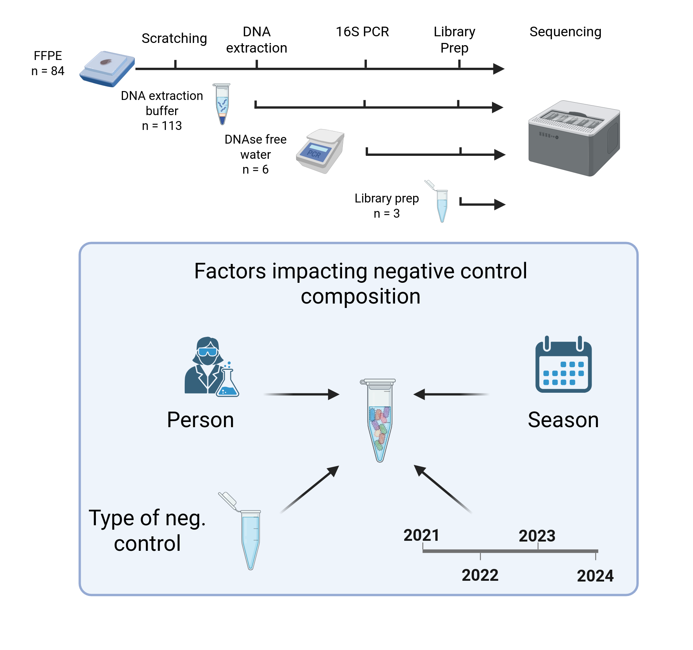{width=75%}

**Figure 1.1.** Schematic of negative control sample collection at each stage of the wetlab processing pipeline (top). Summary of potential significant batch effects associated with negative control samples (bottom).

|  |  |  |
|------------------------|------------------------|------------------------|
| 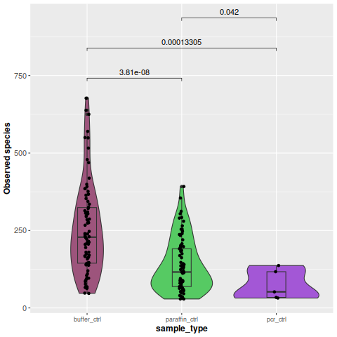 | 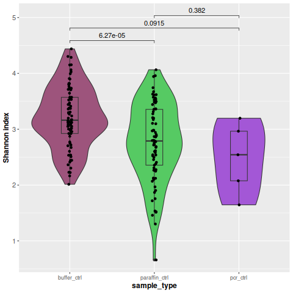 | 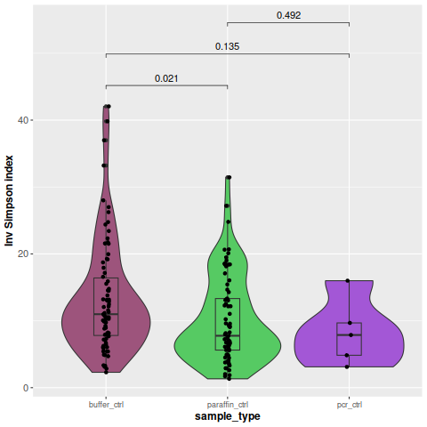 |

**Figure 1.2** A–C) Alpha diversity of NCT samples by control type: observed species richness (A), Shannon index (B), and inverse Simpson index (C). Statistically significant pairwise differences are indicated.

|  |  |
|------------------------------------|------------------------------------|
| 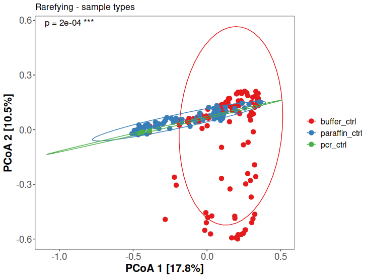 | 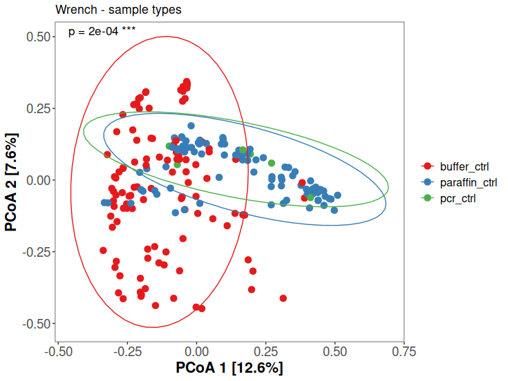 |

**Figure 1.3** (A–B) Beta diversity ordination of NCT samples using rarefaction (A) and Wrench normalization (B). Group centroids and PERMANOVA p-values are shown.

|  |  |
|------------------------------------|------------------------------------|
| 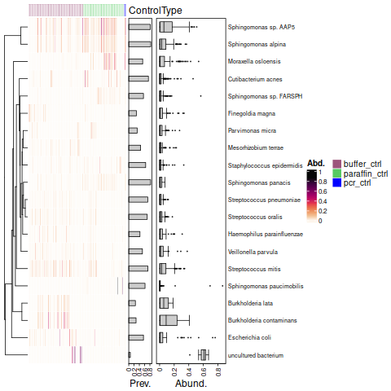 | 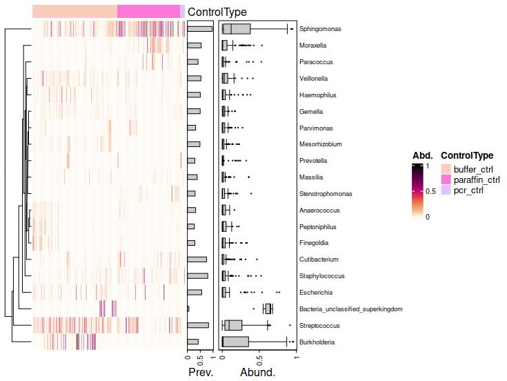 |
| 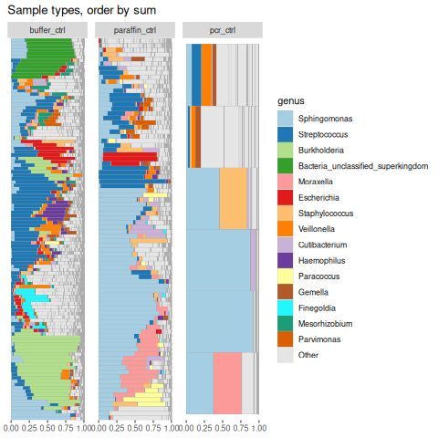 | 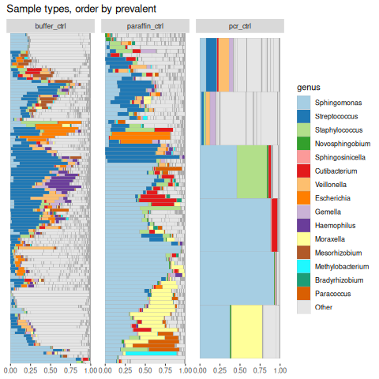 |

**Figure 1.4** Heatmap of the top 20 most abundant taxa in NCT samples at species (left) and genus (right) level. Bottom panels show barplots of the top 20 genera ordered by abundance and prevalence, respectively.

|                                    |
|------------------------------------|
| 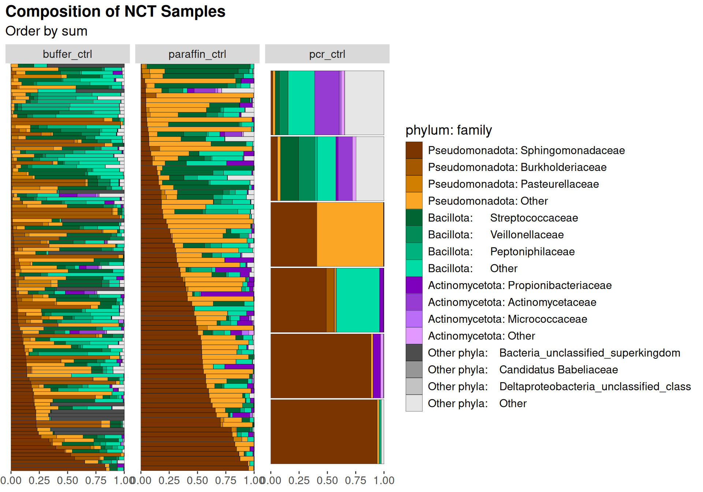 |

**Figure 1.5** Stacked barplot of bacterial composition in negative control samples, stratified by control type.

|                                             |
|----------------------------------------------|
| 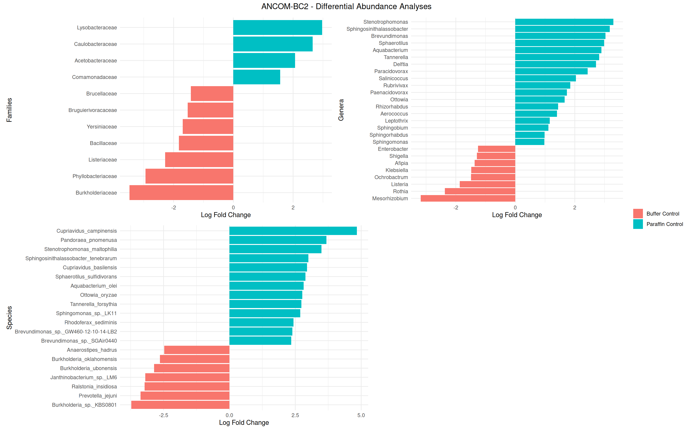 |

**Figure 1.6** Differential abundance analyses via ANCOM-BC2 across various taxonomic rank between paraffin and buffer control types after acconting for technician batch correction.
-->
```

------------------------------------------------------------------------

### 2. Technician Influences Microbiome More Than Processing Environment

```{=html}
<!--
We were intrigued by how human commensals might enter negative control samples. To investigate this, we conducted an experiment in which negative samples were processed by two technicians under different environmental conditions, as described in **Fig. XXX** and detailed in the Materials and Methods section. Analysis of alpha diversity revealed no significant differences across environmental conditions, instead it shows a clear distinction among technicians (Fig. XXX). Similarly, beta diversity analysis showed that samples clustered significantly by technician (\hlred{$p < 0.001$}), but not by environmental conditions alone (\hlred{$p = 0.626$}; Fig. XXX). Importantly noted, when we accounted for technicians fluctuation, the bacterial profiles of clean and normal environments are significantly clustered with p-value **XXX**.

Next, we investigated the differential abundance species between clean and normal conditions. Due to the small amount number of samples as well as sparsity of NCT count tables, we applied ANCOM-BC2 [@Lin2023] and ALDEx2 [@ALDEx2] as alternatives. Regarding to the extremely low read count in NCT samples, we illustrate the DAA between different condition with relaxation of p-value threholds (ANCOM-BC2 as 0.1 and ALDEx2 as 0.2).
-->
```

To investigate the origin of human commensal taxa in NCT samples, we designed a controlled experiment in which two technicians processed negative control samples across two environmental conditions: a standard bench environment and a laminar flow hood (Figure 2.1; see Materials and Methods for full protocol). Alpha diversity analysis revealed no significant difference with respect to environmental condition. However, a clear distinction between technicians was observed (Figure 2.2). Similarly, beta diversity  revealed significant clustering by technician identity (PERMANOVA test - $p-value \le 0.05$), with no significant effect of environmental conditions (p-value = 0.3926; Fig. 2.3). Notably, after adjusting for technician, the bacterial profiles of clean (hood) and standard (bench) conditions diverged significantly (p = 0.02), indicating that while technician-derived contamination is dominant, environmental setting contributes an independent, detectable signal.

Given the low read counts and high sparsity of NCT data, DAA between conditions was performed using ANCOM-BC2 [@Lin2023] and ALDEx2 [@ALDEx2] with relaxed significance thresholds (ANCOM-BC2: $p \le 0.1$; ALDEx2: $p \le 0.2$). These analyses identified a set of taxa consistently enriched under bench conditions, consistent with human skin and oral commensals introduced during opening bench handling (Figure 2.4).

[Need elaborations or skip]{style="color:red"}

```{=html}
<!-- **Figures
|                               |
|-------------------------------|
| 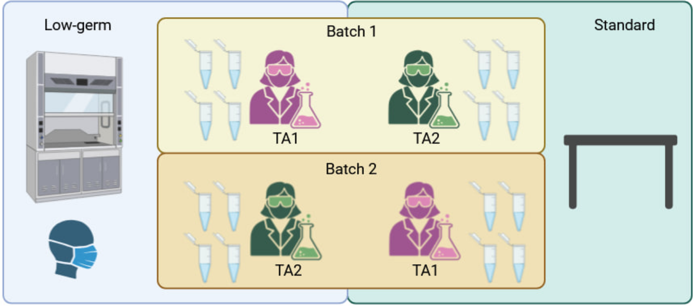 |

**Figure 2.1** Schema of the experimental setting where two technicians processed negative control samples across different environments.

|                                   |                                      |
|-----------------------------------|--------------------------------------|
| 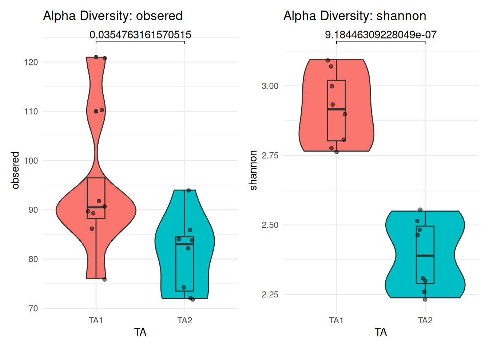 | 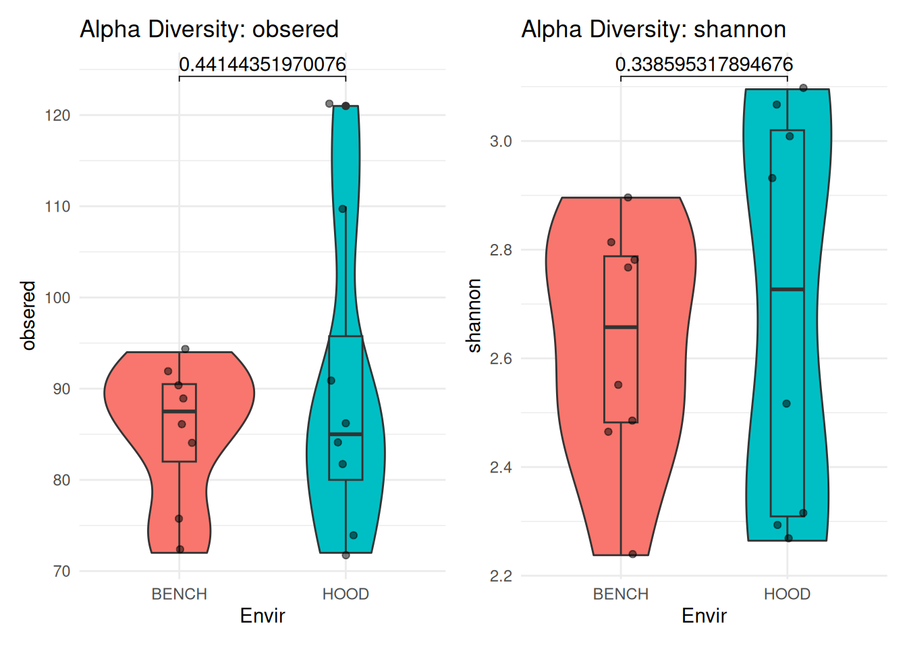 |

**Figure 2.2** Alpha diversity of NCT samples stratified by technician (left) and environmental conditions(right). We used number of observed species as well as Shannon index as metrics for alpha analyses. 


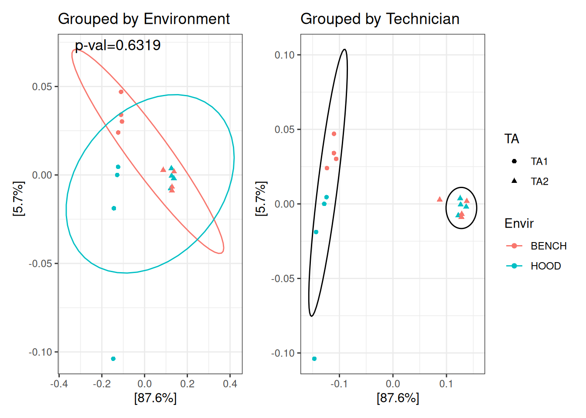

**Figure 2.3** Beta diversity cluster by technicians (left) and environmental conditions (right). Colors depict different environmental conditions, while shapes depict different technicians.

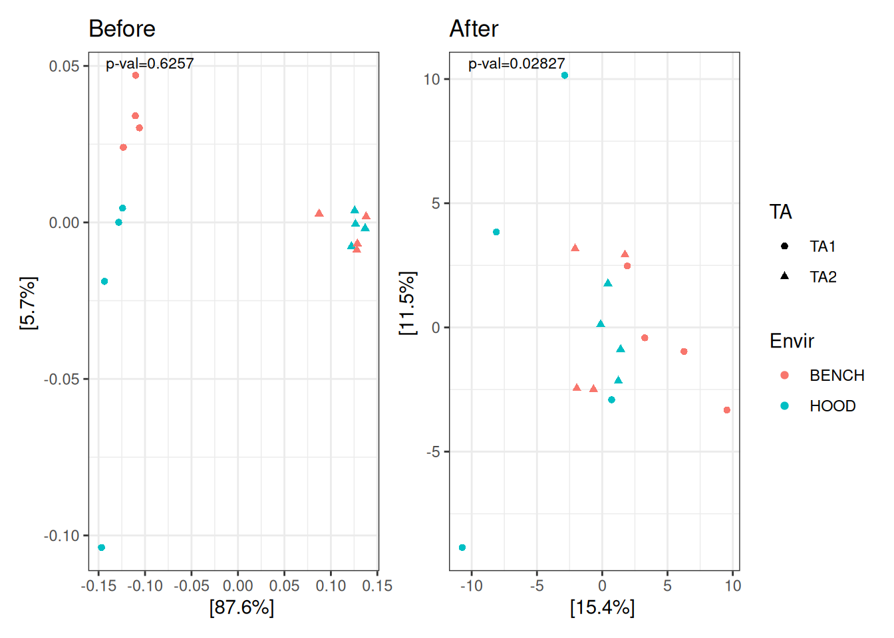

**Figure 2.3+** (perhaps for supplemtary)

|  |  |
|------------------------------------|------------------------------------|
| 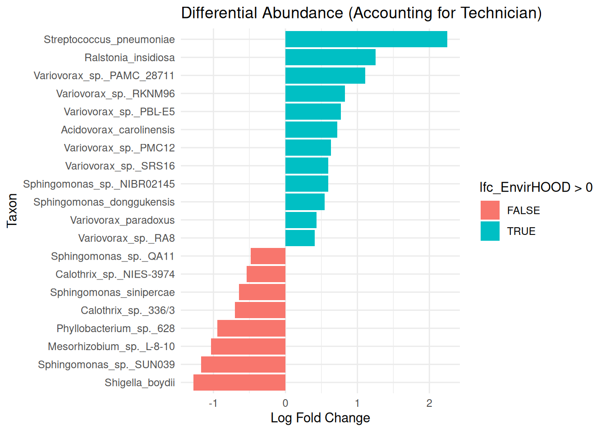 | 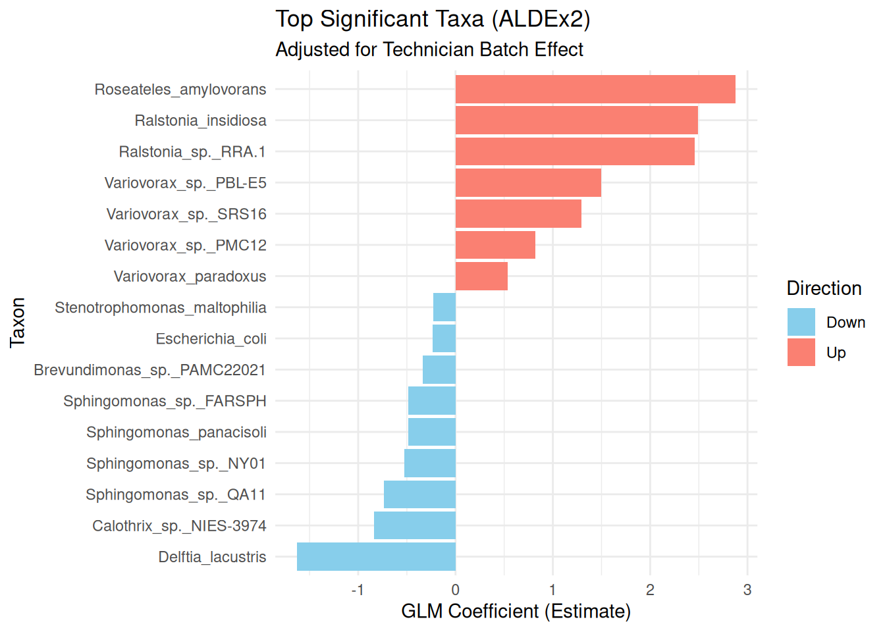 |

**Figure 2.4** Differential abundance analyses between normal (bench) and clean (hood) environments by ANCOM-BC (left) and ALDEx2 (right) respectively.
-->
```

------------------------------------------------------------------------

### 3. Benchmarking of Decontamination Methods

#### 3.1 Assessment Using Longitudinal Negative Control Survey

```{=html}
<!--
We have 18 fresh frozen PDAC samples, corresponding to 18 abundance profile from the 16S sequencing. Consequently, we applied four decontamination methods (restrictive, decontam, SCRuB, and Nj) to the raw data and conducted the assessment.

Due to the lack of ground truth, we employed the contaminant profile derived from the above negative sample survey as true contaminant. Here we proposed a composite score comprising two elements, yield and purity. First, yield is the faction between the number of putative significant taxa not in NCT and the number of observed spieces. Similarly, purity is the fraction of the number of putative significant taxa not in the NCT and the total number of putative significant taxa. The composite score, which is the product of yield and purity, serves two perposes. It rewards a method whose taxa are not in the list of contaminants, while prevent the accessive removal of taxa. For each sample, regarding the decontamination method, we corresponding calculated a composite score. To compare those methods, we applied linear mixed model (Details in Methods section), and noted that Nj method outperformce others. Here we also include raw data as a baseline.
-->
```

We applied four decontamination strategies, including Restrictive filtering, Decontam R package [@Davis2018], SCRuB [@Austin2023], and Nj procedure [@Nejman2020] to the 16S profiles of eighteen fresh frozen PDAC samples, generating four decontaminated abundance tables alongside the unprocessed raw data (retained as a baseline). The benchmarking of various decontamination strategies conducted through simulation and clinical dataset has been reported elsewhere [@Austin2023]. Nevertheless, simulation data could not reflect the complexity of extreme low biomass of intratumoral samples under overwhelmed contaminated environments. Moreover, the human-derived samples in [@Austin2023] do not encounter the extreme low biomass cubersome such as intratumoral PDAC samples we had, thus different approaches for assessment are needed. In the absence of a ground truth, we leveraged the longitudinally derived contaminant profile (Section 1) as a negative reference for evaluation. We defined a composite score comprising two complementary components: yield and purity. First, yield is the proportion of putative significant taxa absent from the NCT survey over the number of observed species. On the other hand, purity is the proportion of NCT-absent taxa among all putative significant taxa over the total number of putative significant taxa. The composite score, which is the product of yield and purity, simultaneously rewards methods that exclude contaminant taxa while prevents excessive removal of true taxa (see Materials and Methods section for more details). Scores were computed per sample, and methods were compared using a linear mixed model (LMM) to account for sample level random effects. The residual normality assumption of LMM was validated through quantile–quantile plot (Supplement Figure 3.1+). The Nj method achieved the highest composite score, significantly outperforming all alternatives (Figure 3.1). Untreated raw data scored lower than Nj and restrictive method, on the same level with Decontam method. Interestingly, the composite score from SCRuB is the smallest. Normally SCRuB shows its effectiveness from the leakage well information, which we do not have in our experimental settings.

Alternatively, we also evaluated the sample-wise composite score for each method and applied paired Wilcoxon signed-rank test as statistical test. Again, we see Nj method outperforms other. (Supplementary Figure 3.2)

#### 3.2 Assessment Using Technical Replicates

```{=html}
<!--
In this subsection, we further validated these decontamination methods using technical replicas of above PDAC samples. We selected 10 PDAC fresh frozen samples with highest read count from the above study, re-sequenced them again, also with 16S sequencing. Our assumption is that, without contaminants, the clean microbial profiles of technical replicas in the same sample should be smaller than the one affected by contaminants. Here we applied Aichiton distance using paired Wilcox test to determine the significant differences. As shown in the figure **XXX**, Nj method yields smallest distance.

Furthermore, we investigated the consistency among decontamination (and raw data) between two replicas. With the same assumption mentioned before, we expect the bacterial profile between these two replica remain close. To measure the consistency, we calculated the fraction between number taxa overlap and total taxa between replicas. In the ideal case, this fraction should be closed to one. Below at Table **XXX** is the results, which shows Nj method achieved highest value. Similar observation regarding to rare taxa removal or in genus rank level gave the same results (in supplementary).
-->
```

To provide an orthogonal validation, we re-sequenced ten fresh frozen PDAC samples which have the highest read counts as technical replicates. Our underlying assumption was that decontaminated profiles, which is less susceptible from random contaminant variation, should exhibit greater concordance between replicates from the same tumor sample than the raw profiles.

Inter-replicate dissimilarity was quantified using Aitchison distance, with pairwise comparisons assessed by paired Wilcoxon signed-rank test. As shown in Figure 3.3, the Nj method obtained the smallest inter-replicate distances, indicating superior within sample consistency. On the other hand, inter-replicate among samples without decontamination show the highest scores, indicating that environmental contaminants could be heterogeneous. Other decontamination methods yielded smaller distances than raw data, but still significantly bigger than Nj method. (See supplementary for more details)

We also validated the results with other distance metric such as Jaccard and various normalization methods such as rarefaction and Wrench normalition, result in similar pattern. (See Suppelemtary figures S3.xxx)

Furthermore, compositional overlap between replicas, measured as the fraction of shared taxa out of total detected taxa between two replicates was also highest for Nj method (Table 2 and Figure 3.4). This measurement estimates the robustness of decontamination procedure. Notably, we excluded the extremly rare taxa and aggrogate data into genus rank level. Other results for rare taxa filtering and different taxonomic rank could be found in the Supplementary (Figures S3.xxx and tables xxx).

**Table 2.** Overlap: fraction of shared taxa over total taxa among replicates, counted in genus rank, with min_prevalence = 5% and min_total_abundance = $1e-4$ from tax_filter function of microViz R package [@Barnett2021].

| Methods ↓ / Features → | n_rep1 | n_rep2 | n_intersect | n_union | fraction |
|------------------------|--------|--------|-------------|---------|----------|
| Raw                    | 140    | 106    | 71          | 175     | 0.406    |
| Restrictive            | 116    | 95     | 66          | 145     | 0.455    |
| Decontam               | 124    | 102    | 70          | 156     | 0.449    |
| SCRuB                  | 136    | 105    | 74          | 167     | 0.443    |
| Nj                     | 63     | 65     | 50          | 78      | 0.641    |

```{=html}
<!-- **Figures
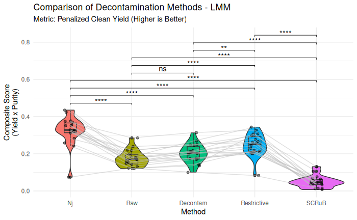

**Figure 3.1** Composite score was calculated for each sample, statistical testing via Linear Mixed Model

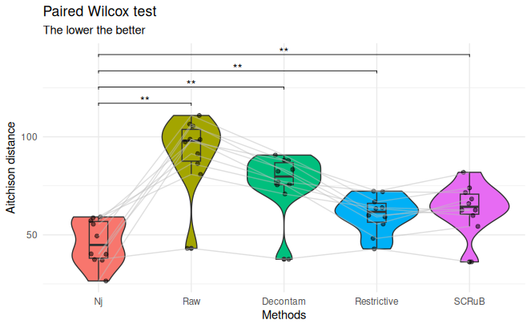

**Figure 3.2** Atchiton distance between replicates, statistical test with paired Wilcox ranked test.
-->
```

### 4. Intratumoral Bacterial Profile of PDAC Fresh Frozen Samples

```{=html}
<!--
We applied those decontamination strategies and investigate intratumoral bacteria of PDAC samples. First,

As the bar plot in Figure **XXX**, we notice that original data are heavily contaminated by such as Sphingomonas in the first replica and Caldibacilus in the second replica. Notably, even with rigorous decontamination processes, the bacterial profiles of those replicas are barely identical, due to heterogeneous distribution of intratumoral microbiome. Nevertheless, with decontamination, the distance between two replica is closer than original data, as shown in the Figure **XXX.** After
-->
```

We applied all decontamination strategies to characterize the intratumoral bacterial community of the ten replicated PDAC fresh-frozen samples. In the raw, un-decontaminated profile, samples were dominated by environmental contaminants. For example, *Sphingomonas* predominated in first replicates of several samples, while *Caldibacillus* was prominent in second replicates of others (see Figure 4.1). These taxa were largely eliminated following decontamination.

Despite rigorous decontamination, the bacterial profiles of technical replicates from the same tumor were not identical, consistent with the known spatial heterogeneity of intratumoral microbiome distributions [@GaleanoNio2022]. Nevertheless, decontamination could be able significantly reduce inter-replicate Aitchison distances relative to raw data (Figure 3.2), supporting the conclusion that residual compositional differences reflect biological variation rather than technical noise. Following Nj decontamination, several taxa with prior biological relevance to PDAC were consistently detected across replicates, including *Alistipes* and *Bacteroides* which are common gut comensal and their proliferation fluctuated across pancreatic patients [] .

## Discussion

In this study, we present a systematic benchmarking framework for assessing decontamination methods in low biomass 16S sequencing of PDAC tumor microbiome. By combining a longitudinal negative control survey with technical replicate sequencing, we establish two complementary: data driven evaluation metrics, a composite yield-purity score, and Aitchison inter-replicate distance which do not require a priori knowledge of true contaminants.

Our negative sample survey revealed that the laboratory contaminant landscape is shaped by multiple interacting batch factors, including control types, processing technicians, year, and season. Crucially, human commensals such as *Veillonella* were present in a majority of NCT samples, challenging the common practice of using any NCT-detected taxon as a definitive contaminant label. Instead, thorough and multi-level filtering such as [@Nejman2020] shows roburst ability to selectively remove likely contaminants while preserving taxon diversity, a balance that is critical when studying the sparse, low abundance microbial communities characteristic of pancreatic tumor tissue.
Notably, due to the limited number of negative control samples, binomial statistical tests may lack the sensitivity required to effectively filter out false positive contaminant taxa. For instance, a taxon appearing in only a single tumor sample, but absent from the NCTs, would pass the binomial test and be misclassified as a true intratumoral taxon. This highlights a potential limitation in contamination detection when NCT sample sizes are insufficient to capture rare contaminants. Thus, instead the Fisher's exact test was used in our study.

The Nj decontamination method consistently outperformed Restrictive filtering, Decontam, and SCRuB across all evaluation metrics. This advantage likely stems from Nj's incorporation of both prevalence-based and rigorous statistical test, as well as its conservative approach to taxon removal. Our findings align with the original validation of this strategy in Nejman et al. (2020), while extending it to a standardized benchmarking context with independent replication.

Several limitations should be considered. First, the NCT profiles used as reference contaminants may not capture all sources of contamination present in intratumoral samples, particularly those introduced at tissue collection. Second, the small sample size (n = 18, and n=10 with replicates) limits statistical power for detecting rare intratumoral taxa and constrains generalizability. Third, FFPE samples, which comprise the majority of archival PDAC biobanks, were not included in the study due to restoration complexity and overwhelmed by environmental contaminants, which beyond the capacity of intratumoral microbiome restoration.

Based on our findings, we recommend the following quality control pipeline for 16S sequencing regarding the intratumoral microbiome studies in PDAC: (1) include negative controls representing all wet-lab processing steps; (2) acquire technical replicates, at least for a subset of samples; (3) consider batch correction along with decontamination; and (4) apply various decontamination method, followed by validation of residual taxa using the composite yield-purity framework and iter-replicates distances described here. Fresh frozen samples should be prioritized over FFPE where feasible, as FFPE restoration introduces additional sources of DNA degradation and chemical modification that complicate microbial profiling.

## Materials and Methods

### Sample Collection and Processing

Negative control samples were collected at every step of a pipeline to counter against contamination. Both NCT and tumor samples were sequenced via 16S rRNA. Dorado (version 0.9) was used as a base-caller, and MetaPONT [@AmmerHerrmenau2021] was used to obtain bacterial profile of a sample. MetaPONT's library comprises complete genome of 13550 bacterial taxa, latest updated on December 2024.

### 16S rRNA Sequencing

### Normalization

We applied rarefaction and Wrench method in R package [@Muthiah2025] for normalization.

### Trivial Filtering Taxa by Prevalence and Abundance

In the section of contaminant survey study as well as contamination investigation in various environments, we utilized taxa_filter function from R package microViz [@Barnett2021] to eliminate extremely rare and possibly noise taxa. The pseudo-code is provided in the technical supplementary file.

In the murine PDAC fresh frozen study which comprises PDAC and corresponding negative control samples, we applied slightly different threshold for each category. For the PDAC true sample, we set the threshold for minimal total abundance as \$1e-6\$, while for their respectively negative control we reduce this threshold to \$5e-7\$, due to the assumption that the microbiome content in negative control is much sparer than in tumor sample. Detail and pseudo-code could be found in the technical supplementary file.

### Statistical Analysis

In the contamination survey and negative sequencing in different environments, we applied t-test and PERNOVA test along with alpha and beta analysis respectively. Multiple testing correction is Benjamini-Hochberg procedure.

In the murine PDAC samples study, we applied either paired Wilcoxon signed rank test or linear mixed model with random effect to evaluate various decontamination methods. Multiple testing correction is Benjamini-Hochberg.

### Decontamination Methods

Four decontamination approaches were evaluated: (1) Restrictive filtering: taxa detected in any NCT samples were excluded from further analyses; (2) Decontam [@Davis2018]: probability-based classification of contaminant taxa using negative control prevalence; (3) SCRuB [@Austin2023]: source tracking-based contaminant removal; and (4) Nejman et. al. procedure [@Nejman2020]: the decontamination strategy incorporating multiple filtering criteria. Notbly, instead of binomial testing as Nejman et al. described in [@Nejman2020], we applied Fisher test instead due to small number of samples and negative controls. The implementation of those four decontamination methods is available in the github repository.

### Composite Score

Composite score is calculated from the bacterial profile after or before decontamination and the longitudinal contaminant survey. This score comprised of two parts: yield and purity. Yield is an entity quantifying the percentage of number of putative true taxa not overlap with NCT survey over number of total observed taxa, while the purity calculates the fraction between the same nominator over the number of putative true taxa from a certain decontamination method. The technical detail of the calculation could be found at Supplementary.  

## Data and Code Availability

## References
