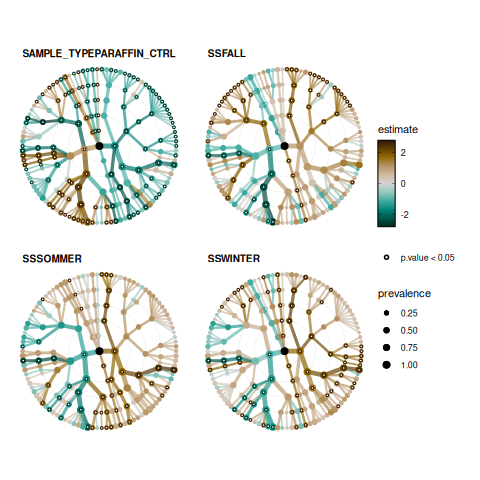
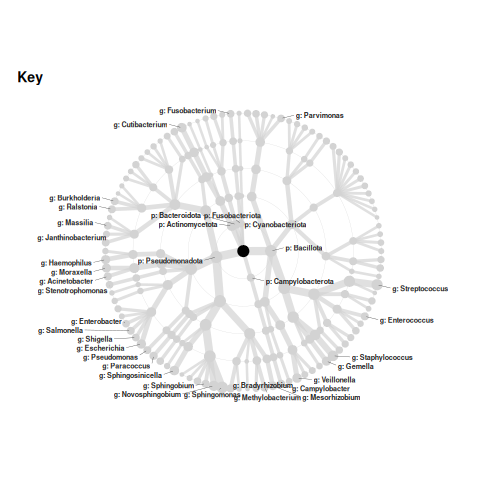

# Disentangling contaminants from true intratumoural microbial signals in pancreatic ductal adenocarcinoma – A benchmarking approach

## Abstract

**Background**: Malignant tumors or more specifically Pancreatic ductal adenocarcinoma (PDAC) harbors their own distinct intratumoral microbiome, yet rigorous characterization of its composition is hampered by pervasive environmental and procedural contamination. Negative controls collected throughout the sample processing workflow capture a heterogeneous mixture of environmental, and technician-derived microbes that, if unaccounted for, mislead 16S rRNA sequencing results.

**Methods**: We systematically collected more than 200 negative control samples (NCT) comprising buffer, paraffin, and PCR controls, over period of four years and other possible significant batches such as years, seasons, technicians. We applied and benchmarked four decontamination methods (Restrictive filtering, Decontam, SCRuB, and the Nejman pipeline) against this NCT-derived contaminant profile, using both a composite score. Further, we validated those methods via technical replicas with Aitchison distance between them as orthogonal evaluation metrics.

**Results**: Microbial profiles of NCT samples were significantly determined by control type, technician, year, and season, reflecting complex batch effects. The 20 most abundant contaminant taxa spanned well-characterized environmental genera (e.g., *Sphingomonas*) and human commensals (e.g., *Veillonella parvula*). Decontamination benchmarking demonstrated that the Nj method consistently outperformed alternatives in both composite score and inter-replicate concordance. Application of Nj to fresh frozen PDAC samples substantially reduced contaminant burden while preserving putative tumor-associated signals.

**Conclusions**: This benchmarking framework, combining longitudinal NCT profiling with technical replication, enables principled assessment of decontamination performance in the absence of a ground truth. Our results support the adoption of the Nj decontamination pipeline for future intratumoral microbiome studies in PDAC and provide a reliable, quality control strategy for low-biomass 16S sequencing studies.

**Keywords**: pancreatic ductal adenocarcinoma, tumor microbiome, decontamination, negative controls, 16S rRNA sequencing, benchmarking.

## Introduction

## Results

***Structure for result section***

<!--[some *blue* text]{style="color:green"}. -->

-   Contaminant species survey in the lab
    -   [Description of data collection, number of samples and taxa, significant batch effects.]{style="color:green"}
    -   [Alpha/beta analyses.]{style="color:green"}
    -   [Barplot composition / heatmap plot of bacterial composition of NCT.]{style="color:green"}
    -   DAA among control types
        -   Tables and figures
        -   Description
    -   Remarks
-   Hood vs. bench environments
    -   Experimetal setting
    -   Alpha/beta analyses, batch effect
    -   DAA w.r.t technicians
-   Decontamination method benchmarking
    -   Using bacterial profile before/after decontamination and contaminants survey for assessment
    -   Distance between technical replicas for assessment
-   Intratumoral microbiome in PDAC with replicas
    -   Each decontamination method, microbial composition corresponding.
    -   Composition of overlap between different methods
    -   Composition overlap between replicas for each method.
-   (FFPE restroration)
-   Suggested pipeline
    -   For 16S sequencing with ONT
    -   Fresh forzen tissue instead of FFPE
    -   Involve negative controls, technical replica, Bioinformatics: batch correction and decontamination

### 1. Contamination Survey in the Laboratory

#### 1.1 Negative Control Samples Collection

<!--

To address the issue of environmental contamination, we comprehensively collected a large number of negative control samples (NCT) at each stage of the wet-lab sample processing workflow (Fig. 1.1), including **93** paraffin controls, **133** buffer controls, **11** PCR controls, and **3** sequencing controls, resulting in a total of 6128 taxa. We remove sequencing control samples due to insufficient reads (≤ 750) as well as taxa with extremely low prevalence and abundance. With that criteria, we further filter out and result in **203** negative control samples, comprising **113** buffer controls, **84** paraffin controls, and **6** PCR control. That results in ~~**1775**~~**2305** taxa ~~after rarefaction as normalization~~. These negative controls were accumulated over several years, with a significant expansion in control type paraffin and buffer introduced in 2022 (Table 1 ). We also recorded several possible batch such as technicians who processed samples, year and season of processing and control types.

-->

To comprehensively characterize the contaminant landscape, we collected negative control (NCT) samples at each stage of the wetlab processing pipeline (Fig. 1.1), including 93 paraffin controls, 133 buffer controls, 11 PCR controls, and 3 sequencing controls, yielding an initial pool of 6,128 taxa. Sequencing controls were excluded due to insufficient read depth (≤750 reads). Taxa with extremely low prevalence or abundance were removed, and samples were normalized via Wrench or rarefication. After filtering, 203 NCT samples remained: 113 buffer controls, 84 paraffin controls, and 6 PCR controls, encompassing 1,775 taxa after rarefaction and 2,305 taxa prior to rarefaction. These controls were accumulated between 2021 and 2024, with a sharp expansion of paraffin and buffer control types introduced in 2022 (Table 1). Relevant batch covariates include processing technician, year, and season.

#### 1.2 Alpha and Beta Diversity of Negative Controls

<!--
Significant differences in microbial profiles (alpha and beta diversity) were observed across different control types (Fig. 1 & 2). Similar patterns were also found for other factors such as technician, year, and season of sequencing (in Supplementary Materials Figure 1.2, 1.3). In buffer samples, the number of species and their evenness statistically significant than the others. Notably, the association measured through Chi-suqare test among batches in sample data indicates that they are not independent (Supplementary). Thus, it is not clear if the difference in bacterial profile among control types are from their own bacterial community or due to batch effects.
-->

Significant differences in microbial diversity were observed across control types (Figs. 1.2, 1.3). Buffer controls exhibited significantly higher species richness and evenness compared to paraffin and PCR controls, as measured by observed species count, Shannon index, and inverse Simpson index. Analogous patterns were observed when stratifying by technician, year, and season (Supplementary Figures S1.2, S1.3), suggesting pervasive batch structure in the contaminant pool. Importantly, chi-square testing confirmed non-independence among batch variables (p < 0.05; Supplementary Table S1), precluding simple attribution of diversity differences to control type alone.

#### 1.3 Microbial Composition of Negative Control Samples

<!--
The 20 most abundant taxa in whole set of NCT represented a mixture of known environmental microbes and potential human commensals (Fig. 1.4, 1.5). For example, *Sphingomonas*, a well-known environmental taxon frequently found in hospital settings, was detected with high abundance in nearly all negative controls. In contrast, human-associated taxa such as *Veillonella parvula*, previously reported in PDAC-related studies [@McKinley2023], were present in approximately 60 percent of NCT samples but at significantly lower abundance (Fig.3). This highlights the importance of not discarding all taxa found in negative controls, but instead applying appropriate decontamination approaches [@Austin2023; @Davis2018; @Nejman2020] to systematically remove likely environmental contaminants.

Notebly, after accounting for other batch effects, we investigated the differential abundance species among control types. Taxa xxx and xxx in paraffin controls are significantly expressed ...
-->

The 20 most abundant taxa identified across all NCT samples consisted of a mixture of well characterized environmental microbes and small portion of human commensals (Figs. 1.4, 1.5). For example, Sphingomonas, a ubiquitous environmental genus frequently detected in hospital and laboratory settings, was among the most abundant taxa in nearly all negative controls. In contrast, the human commensal Veillonella parvula, previously reported in PDAC-associated microbiome studies [@McKinley2023], was present in approximately 60% of NCT samples but at considerably lower abundance (Fig. 1.5). This coexistence of environmental and human commensal taxa in negative controls requires a need for nuanced decontamination strategies — indiscriminate removal of all NCT-associated taxa risks eliminating clinically relevant tumor microbiome signals.

Following correction for batch effects, differential abundance analysis (DAA) among control types identified several taxa specifically enriched in paraffin controls (taxa **XXX** from the analyses), pointing to contamination sources specific to paraffin embedding procedures.

<!-- **Figures and Tables** -->

**Table 1.** Negative control samples collected across years, stratified by control types.

| Sample ↓ / Feature → | 2021 | 2022 | 2023 | 2024 |
|----------------------|------|------|------|------|
| Buffer               | 29   | 60   | 24   | 0    |
| Paraffin             | 5    | 57   | 11   | 12   |
| PCR                  | 0    | 3    | 3    | 0    |

**Figure 1.1.** Schematic of negative control sample collection at each stage of the wetlab processing pipeline (top). Summary of potential significant batch effects associated with negative control samples (bottom).

|  |  |  |
|------------------------|------------------------|------------------------|
|  |  |  |

**Figure 1.2** A–C) Alpha diversity of NCT samples by control type: observed species richness (A), Shannon index (B), and inverse Simpson index (C). Statistically significant pairwise differences are indicated.

|  |  |
|------------------------------------|------------------------------------|
|  |  |

**Figure 1.3** (A–B) Beta diversity ordination of NCT samples using rarefaction (A) and Wrench normalization (B). Group centroids and PERMANOVA p-values are shown.

|  |  |
|------------------------------------|------------------------------------|
|  |  |
|  |  |

**Figure 1.4** Heatmap of the top 20 most abundant taxa in NCT samples at species (left) and genus (right) level. Bottom panels show barplots of the top 20 genera ordered by abundance and prevalence, respectively.

|                                    |
|------------------------------------|
|  |

**Figure 1.5** Stacked barplot of bacterial composition in negative control samples, stratified by control type.

|  |  |
|------------------------------------|------------------------------------|
|  |  |

**Figure 1.6** Differential abundance between control types after batch correction. (**Need a new figure**)

------------------------------------------------------------------------

### 2. Technician Influences Microbiome More Than Processing Environment

<!--
We were intrigued by how human commensals might enter negative control samples. To investigate this, we conducted an experiment in which negative samples were processed by two technicians under different environmental conditions, as described in **Fig. XXX** and detailed in the Materials and Methods section. Analysis of alpha diversity revealed no significant differences across environmental conditions, instead it shows a clear distinction among technicians (Fig. XXX). Similarly, beta diversity analysis showed that samples clustered significantly by technician (\hlred{$p < 0.001$}), but not by environmental conditions alone (\hlred{$p = 0.626$}; Fig. XXX). Importantly noted, when we accounted for technicians fluctuation, the bacterial profiles of clean and normal environments are significantly clustered with p-value **XXX**.

Next, we investigated the differential abundance species between clean and normal conditions. Due to the small amount number of samples as well as sparsity of NCT count tables, we applied ANCOM-BC2 [@Lin2023] and ALDEx2 [@ALDEx2] as alternatives. Regarding to the extremely low read count in NCT samples, we illustrate the DAA between different condition with relaxation of p-value threholds (ANCOM-BC2 as 0.1 and ALDEx2 as 0.2).
-->

To investigate the origin of human commensal taxa in NCT samples, we designed a controlled experiment in which two technicians processed negative control samples under two environmental conditions: a standard bench environment and a laminar flow hood (Fig. 2.1; see Materials and Methods for full protocol). Alpha diversity analysis revealed no significant difference with respect to environmental condition; however, a clear distinction between technicians was observed (Fig. 2.2). Beta diversity analysis similarly demonstrated significant clustering by technician identity (PERMANOVA p < 0.05), with no significant effect of environmental (p = 0.6; Fig. 2.3). Notably, after adjusting for technician, the bacterial profiles of clean (hood) and standard (bench) conditions diverged significantly (p = 0.02), indicating that while technician-derived contamination is dominant, environmental setting contributes an independent, detectable signal.

Given the low read counts and high sparsity of NCT data, DAA between conditions was performed using ANCOM-BC2 [@Lin2023] and ALDEx2 [@ALDEx2] with relaxed significance thresholds (ANCOM-BC2: q < 0.1; ALDEx2: p < 0.2). These analyses identified a set of taxa consistently enriched under bench conditions, consistent with human skin and oral commensals introduced during opening bench handling (Fig. 2.4).

|                                    |
|------------------------------------|
|  |

**Figure 2.1** Experimental setting.

|                                   |                                      |
|-----------------------------------|--------------------------------------|
|  |  |

**Figure 2.2** Alpha diversity of NCT sample w.r.t environmental conditions(left) and technicians (right).

**Figure 2.3** Beta diversity cluster by conditions and technicians respectively with corresponding p-values. (Left) xxx. (Right) xxx

|  |  |
|------------------------------------|------------------------------------|
|  |  |

**Figure 2.4** Differential abundance analyses between normal (bench) and clean (hood) environments by ANCOM-BC (left) and ALDEx2 (right) respectively.

------------------------------------------------------------------------

### 3. Benchmarking of Decontamination Methods

#### 3.1 Assessment Using Longitudinal Negative Control Survey

<!--
We have 18 fresh frozen PDAC samples, corresponding to 18 abundance profile from the 16S sequencing. Consequently, we applied four decontamination methods (restrictive, decontam, SCRuB, and Nj) to the raw data and conducted the assessment.

Due to the lack of ground truth, we employed the contaminant profile derived from the above negative sample survey as true contaminant. Here we proposed a composite score comprising two elements, yield and purity. First, yield is the faction between the number of putative significant taxa not in NCT and the number of observed spieces. Similarly, purity is the fraction of the number of putative significant taxa not in the NCT and the total number of putative significant taxa. The composite score, which is the product of yield and purity, serves two perposes. It rewards a method whose taxa are not in the list of contaminants, while prevent the accessive removal of taxa. For each sample, regarding the decontamination method, we corresponding calculated a composite score. To compare those methods, we applied linear mixed model (Details in Methods section), and noted that Nj method outperformce others. Here we also include raw data as a baseline.
-->

We applied four decontamination strategies, including Restrictive filtering, Decontam R package [@Davis2018], SCRuB [@Austin2023], and Nj procedure [@Nejman2020] to the 16S profiles of 18 fresh frozen PDAC samples, generating four decontaminated abundance tables alongside the unprocessed raw data (retained as a baseline).
In the absence of a ground truth, we leveraged the longitudinally derived contaminant profile (Section 1) as a reference for evaluation. We defined a composite score comprising two complementary components. Specially, yield is the proportion of putative significant taxa absent from the NCT list over  the number of observed spieces. On the other hand, purity is the proportion of NCT-absent taxa among all putative significant taxa over the total number of putative significant taxa. The composite score, which is the product of yield and purity, simultaneously rewards methods that exclude contaminant taxa and penalizes excessive removal of true taxa (see Materials and Methods section for more details). Scores were computed per sample, and methods were compared using a linear mixed model to account for sample level random effects. The Nj method achieved the highest composite score, significantly outperforming all alternatives (Fig. XXX). Untreated raw data scored lowest, confirming heavy contamination burden in the unprocessed data.

#### 3.2 Assessment Using Technical Replicates

<!--
In this subsection, we further validated these decontamination methods using technical replicas of above PDAC samples. We selected 10 PDAC fresh frozen samples with highest read count from the above study, re-sequenced them again, also with 16S sequencing. Our assumption is that, without contaminants, the clean microbial profiles of technical replicas in the same sample should be smaller than the one affected by contaminants. Here we applied Aichiton distance using paired Wilcox test to determine the significant differences. As shown in the figure **XXX**, Nj method yields smallest distance.

Furthermore, we investigated the consistency among decontamination (and raw data) between two replicas. With the same assumption mentioned before, we expect the bacterial profile between these two replica remain close. To measure the consistency, we calculated the fraction between number taxa overlap and total taxa between replicas. In the ideal case, this fraction should be closed to one. Below at Table **XXX** is the results, which shows Nj method achieved highest value. Similar observation regarding to rare taxa removal or in genus rank level gave the same results (in supplementary).
-->

To provide an orthogonal validation, we re-sequenced 10 PDAC fresh frozen samples with the highest read counts as technical replicates. Our underlying assumption was that decontaminated profiles, freed from random contaminant variation, should exhibit greater concordance between replicates from the same tumor than raw profiles.

Inter-replicate dissimilarity was quantified using Aitchison distance, with pairwise comparisons assessed by paired Wilcoxon signed-rank test. As shown in Fig. **XXX**, the Nj method again yielded the smallest inter-replicate distances, indicating superior within sample consistency. Compositional overlap between replicas — measured as the fraction of shared taxa out of total detected taxa — was also highest for Nj (Table 2). These findings were robust to sensitivity analyses excluding rare taxa and at the genus rank level (Supplementary Materials).

**Table 2.** Overlap: fraction of shared taxa over total taxa among replicates.

| Methods ↓ / Features → | n_rep1 | n_rep2 | n_intersect | n_union | fraction |
|----------------------|------|------|------|------|------|
| Raw               | 140 |   106   |   71  |   175   |   0.406 |
| Restrictive       | 116 |    95   |  66   |  145    |   0.455 |
| Decontam                  | 0    | 3    | 3    | 0    | 0 |
| SCRuB             | xx  | xx  | xx  | xx  | xx  |
| Nj                | xx  | xx  | xx  | xx  | xx  |

### Intratumoral Bacterial Profile of PDAC Fresh Frozen Samples

We applied those decontamination strategies and investigate intratumoral bacteria of PDAC samples. First,

As the bar plot in Figure **XXX**, we notice that original data are heavily contaminated by such as Sphingomonas in the first replica and Caldibacilus in the second replica. Notably, even with rigorous decontamination processes, the bacterial profiles of those replicas are barely identical, due to heterogeneous distribution of intratumoral microbiome. Nevertheless, with decontamination, the distance between two replica is closer than original data, as shown in the Figure **XXX.** After

## Discussion

## References
